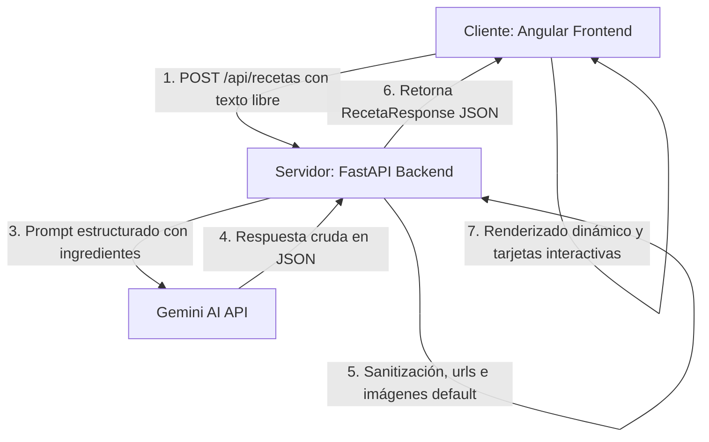

# 🍳 ChefIA - Asistente de Recetas Inteligente

¡Bienvenido a **ChefIA**! Una aplicación web inteligente diseñada para ayudarte a crear recetas deliciosas basadas exclusivamente en los ingredientes que tienes a mano.

La aplicación combina un backend ágil basado en **FastAPI** que utiliza la inteligencia artificial de **Gemini** con un frontend interactivo y reactivo desarrollado en **Angular** empleando modernas características como **Signals**.

---

## 🏗️ Arquitectura del Sistema

ChefIA está estructurada bajo una arquitectura desacoplada de Cliente-Servidor:



---

## 🚀 Características Clave

1. **Extracción Inteligente de Ingredientes**: El usuario puede escribir mensajes en lenguaje natural (ej: *"tengo tomates, cebollas y algo de pollo"*). El backend procesa, limpia y extrae los ingredientes automáticamente antes de consultar al modelo de IA.
2. **Generación con Gemini AI**: Integra el SDK oficial `google-genai` con el modelo `gemini-2.5-flash` para proponer exactamente tres recetas que hagan uso creativo de los ingredientes proporcionados.
3. **Control de Errores y Tolerancia a Fallos**: El backend incluye políticas de reintento automático ante errores temporales del servidor de Gemini y mensajes descriptivos sobre límites de cuota diarios.
4. **Normalización Segura**: Procesa la salida de la IA para corregir y normalizar tipos de datos (como porciones, minutos y listas de instrucciones), evitando bloqueos en la interfaz.
5. **UI Premium y Temas**: Interfaz interactiva responsiva con barra lateral de navegación, soporte para tema claro/oscuro, tarjetas dinámicas expandibles para visualizar recetas y posibilidad de "guardar" recetas como favoritas localmente.

---

## 🛠️ Stack Tecnológico

### Backend
* **Python 3.12+**
* **FastAPI**: Framework web rápido para la construcción de APIs.
* **Google GenAI SDK**: Integración con los modelos generativos de Google Gemini.
* **Pydantic v2**: Validación y estructuración de esquemas de datos.
* **Uvicorn**: Servidor ASGI de alto rendimiento.
* **Python-dotenv**: Gestión segura de configuraciones y variables de entorno.

### Frontend
* **Angular 19+ (CLI v21)**
* **Angular Signals**: Gestión del estado del chat e historial de forma reactiva y eficiente.
* **HttpClient**: Comunicación fluida con endpoints HTTP.
* **FontAwesome / Tailwind / Custom CSS**: Estilos limpios, modernos y responsivos con soporte de temas dinámicos.

---

## 📁 Estructura del Proyecto

```text
ChefIA/
├── chefia-backend/               # Código fuente del backend (FastAPI)
│   ├── app/
│   │   ├── config/               # Configuración global e inicialización de variables de entorno
│   │   ├── models/               # Modelos Pydantic para la validación de request/response
│   │   ├── prompts/              # Prompts estructurados enviados a la IA
│   │   ├── routes/               # Definición de rutas y endpoints de la API (Endpoints REST)
│   │   ├── services/             # Lógica de interacción con Gemini y procesamiento NLP
│   │   ├── utils/                # Utilidades de formateo
│   │   └── main.py               # Punto de entrada de la aplicación FastAPI y políticas CORS
│   ├── .env                      # Configuración de credenciales (API Key) y modelo
│   ├── requirements.txt          # Dependencias y paquetes de Python
│   └── run.py                    # Script ejecutable auxiliar
└── chefia-frontend/              # Código fuente del frontend (Angular)
    ├── src/
    │   ├── app/
    │   │   ├── components/       # Componentes reusables (chat, mensaje, sidebar, receta-card, chat-input)
    │   │   ├── models/           # Interfaces TypeScript para tipado estricto de datos
    │   │   ├── services/         # Servicios de Angular para interacción HTTP y temas visuales
    │   │   └── app.ts            # Componente raíz de la interfaz
    │   ├── main.ts               # Inicialización de la aplicación Angular
    │   └── styles.css            # Estilos globales y variables de tema CSS
    └── package.json              # Script y dependencias de Node.js
```

---

## ⚙️ Guía de Configuración e Instalación

### 1. Requisitos Previos
* **Python 3.12** o superior instalado.
* **Node.js 18+** y **npm** instalados.

---

### 2. Configuración del Backend

1. Entra a la carpeta del backend:
   ```bash
   cd chefia-backend
   ```
2. Crea e instala un entorno virtual (opcional pero recomendado):
   ```bash
   python -m venv venv
   # En Windows
   .\venv\Scripts\activate
   # En macOS/Linux
   source venv/bin/activate
   ```
3. Instala las dependencias necesarias:
   ```bash
   pip install -r requirements.txt
   ```
4. Configura el archivo `.env` en la raíz de `chefia-backend` con las siguientes variables:
   ```env
   APP_NAME="ChefIA"
   APP_VERSION="1.0.0"
   GEMINI_MODEL="gemini-2.5-flash"
   GEMINI_API_KEY="TU_GEMINI_API_KEY_AQUI"
   ```
5. Inicia el servidor de desarrollo:
   ```bash
   uvicorn app.main:app --reload --port 8000
   ```
   El backend estará disponible en: [http://localhost:8000](http://localhost:8000)

---

### 3. Configuración del Frontend

1. Entra a la carpeta del frontend:
   ```bash
   cd chefia-frontend
   ```
2. Instala los paquetes y dependencias de npm:
   ```bash
   npm install
   ```
3. Levanta el servidor local de desarrollo de Angular:
   ```bash
   npm start
   # o bien
   ng serve
   ```
4. Abre tu navegador y navega a [http://localhost:4200](http://localhost:4200)

---

## 📋 Especificación de la API

### Generar Recetas
Solicita sugerencias de recetas a la IA en base a ingredientes.

* **URL**: `/api/recetas`
* **Método**: `POST`
* **Headers**: `Content-Type: application/json`

#### Formato de Petición (Request Body)
```json
{
  "mensaje": "Tengo papas, pollo y tomates en el refrigerador, ¿qué puedo preparar?",
  "ingredientes": null
}
```
*Si se proporciona una lista en `"ingredientes"`, se prioriza y utiliza directamente omitiendo la extracción automática por lenguaje natural del campo `"mensaje"`.*

#### Formato de Respuesta Exitosa (Response Body - 200 OK)
```json
{
  "recetas": [
    {
      "nombre": "Pollo al horno con papas y salsa de tomate",
      "descripcion": "Una receta clásica y reconfortante que aprovecha la jugosidad del pollo.",
      "tiempo_preparacion": 45,
      "dificultad": "Fácil",
      "ingredientes": [
        "2 piezas de pollo",
        "3 papas medianas en rodajas",
        "2 tomates triturados",
        "1 cucharadita de aceite de oliva",
        "Sal y pimienta al gusto"
      ],
      "instrucciones": [
        "Precalentar el horno a 200°C.",
        "Colocar las papas en una bandeja para hornear y sazonar.",
        "Disponer el pollo sobre las papas y bañar con el tomate triturado y el aceite.",
        "Hornear durante 35-40 minutos hasta que el pollo esté dorado y cocido."
      ],
      "porciones": 2,
      "termino_imagen": "pollo al horno con papas",
      "imagen_url": "https://source.unsplash.com/640x420/?pollo+al+horno+con+papas+comida+plato",
      "fuente_url": "https://www.google.com/search?q=receta+Pollo+al+horno+con+papas+y+salsa+de+tomate"
    }
  ]
}
```

---

